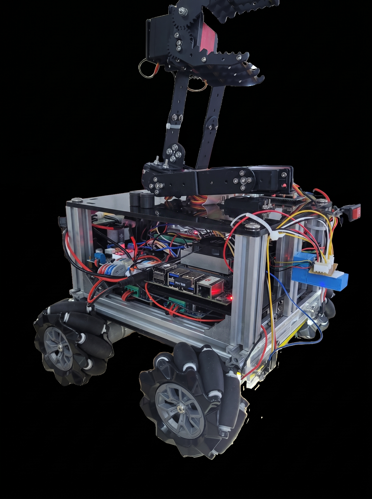
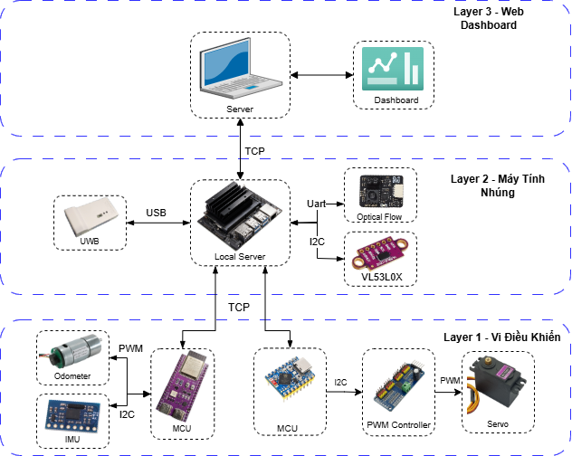
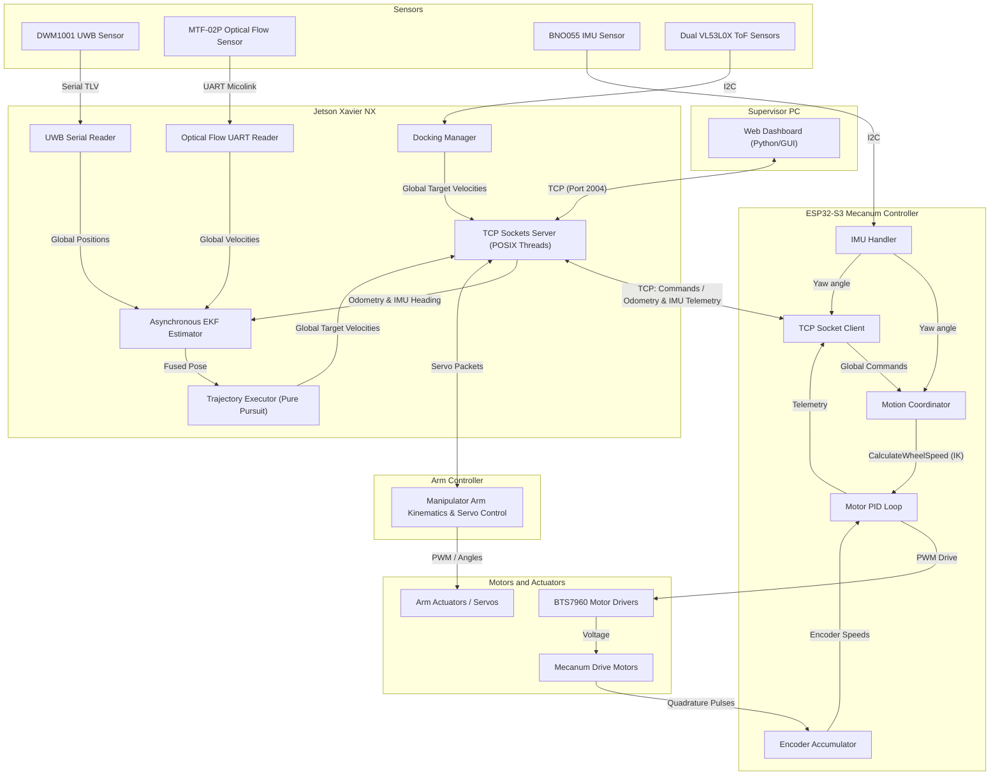
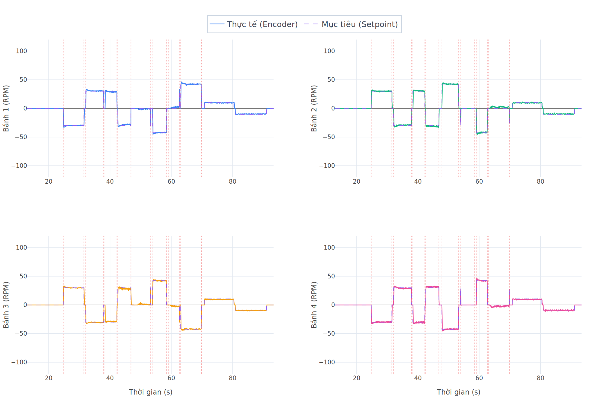
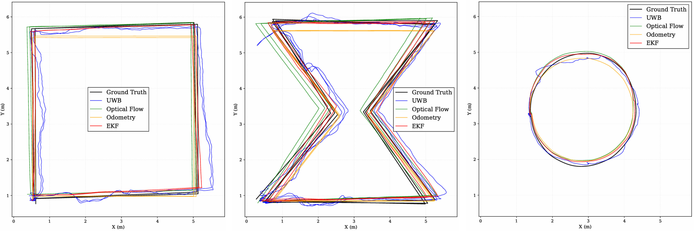
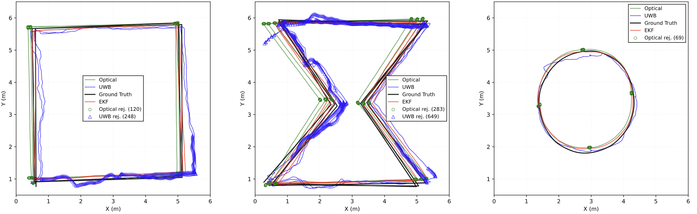
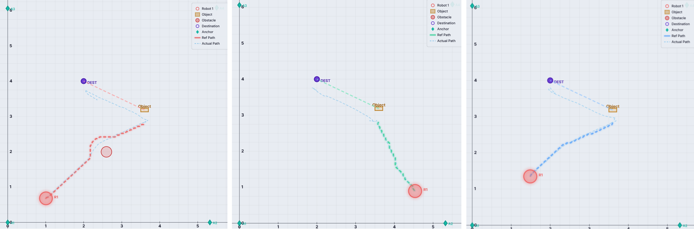

# Mobile Manipulator System with Asynchronous Multi-Sensor Localization

*A two-member bachelor thesis project integrating a Mecanum mobile base, a robotic manipulator, a supervisory dashboard, and an asynchronous multi-sensor localization and control pipeline.*

---



<p align="center">
  <a href="https://drive.google.com/file/d/1CB2-x-rkpqmtqp9mHgwVedte7a-14cni/view?usp=sharing" target="_blank">
    
  </a>
</p>

---

## System Overview

This repository contains the integrated software and firmware implementation for a mobile manipulator robot developed as a bachelor's thesis project. The system integrates an omnidirectional Mecanum mobile base, a multi-axis robotic arm, and a suite of range, flow, and orientation sensors. The system is structured across three primary computing layers:

| Layer | Platform | Main responsibilities |
|---|---|---|
| **Supervisor PC** | Host Computer | Runs the graphical Web Dashboard to compile telemetry, dispatch trajectory coordinates, and display execution results. |
| **Jetson Xavier NX** | Central SBC | Acts as the central system coordinator. It processes asynchronous sensor data feeds to execute state estimation, coordinates path tracking, runs close-range docking algorithms, and routes commands. |
| **ESP32 Controllers** | Microcontrollers | Low-level microcontrollers that execute hardware polling, drive actuators, and compute closed-loop control routines. One controller manages the Mecanum mobile base, and another drives the robotic manipulator servos. |

---

## End-to-End Operation

The robot navigates, aligns, and performs object handling through a sequential pipeline:

1.  **Trajectory Dispatch**: The supervisor system plans and transmits a trajectory consisting of coordinate waypoints to the Jetson Xavier NX.
2.  **Asynchronous Estimation**: The Jetson fuses data from the on-board sensors (UWB, optical flow, encoders, and IMU) to maintain the global robot pose.
3.  **Path Tracking**: The Pure Pursuit controller evaluates the current pose and generates velocity commands in the Global Map Frame.
4.  **Low-Level Kinematics and Control**: The ESP32 Mecanum controller receives global velocity commands, rotates them into the body frame using its local IMU heading, and applies closed-loop PID control to regulate motor speeds.
5.  **Distance-Based Docking**: Upon entering the goal's acceptance zone, the Jetson switches to a close-range docking state machine, utilizing dual VL53L0X Time-of-Flight (ToF) rangefinders to align and position the base.
6.  **Manipulator Grasping**: Once docked, the robotic arm executes kinematics-based trajectories to perform object grasping and transport.

---

## System Architecture



*Primary ownership of each subsystem is summarized in the Project Scope and Team Contributions section.*

---

## Key System Capabilities

*   **Distributed Control Architecture**: Three-layer network topology linking user interfaces, high-level estimation routines, and low-level actuators.
*   **Omnidirectional Base Actuation**: Mecanum drive kinematics enabling lateral, longitudinal, and rotational mobility.
*   **Asynchronous Localization**: An event-driven state estimator fusing UWB position, MTF-02P optical flow velocity, wheel encoders, and IMU heading.
*   **Pure Pursuit Path Tracking**: Automatic waypoint navigation with deceleration profiling and global-to-body coordinate partitioning.
*   **Precision Rangefinder Docking**: Alignment control using two I2C Time-of-Flight rangefinders for close-range surface tracking.
*   **Web-Based Monitoring**: Remote telemetry interface for system monitoring, path dispatch, and data visualization.
*   **Robotic Manipulation**: Synchronized kinematics and trajectory planning for pick-and-place operation.
*   **Physical System Validation**: Empirical testing of state estimation, path accuracy, and power performance on physical hardware.

---

## Project Evolution

The physical Mecanum platform was developed from July 2025 to May 2026 through initial localization research, a physical multi-robot configuration, and the final single-mobile-manipulator thesis configuration. Legacy multi-robot modules remain in the repository.

---

## Project Scope and Team Contributions

This repository represents the integrated codebase developed for a two-member bachelor thesis. Both members contributed to the overall integration, hardware assembly, and physical system verification, while maintaining primary responsibility for different subsystems.

| Team member | Primary responsibilities |
|---|---|
| Phuc-Nhan Huynh | Mecanum mobile base, hardware selection and integration, ESP32-S3 motor-control firmware, Jetson-side C software, asynchronous multi-sensor localization, Mahalanobis gating, Pure Pursuit trajectory tracking, dual-VL53L0X docking, and physical validation |
| Nhat-Minh Nguyen | Web Dashboard, robotic-arm hardware, manipulator kinematics, arm trajectory generation, and servo-control firmware |

*The following sections provide additional technical detail for the Mecanum, localization, tracking, docking, and embedded-control subsystem implemented by Phuc-Nhan Huynh.*

---

## Mecanum Control and Localization Subsystem

### 1. ESP32-S3 Firmware and Wheel-Speed Control
The low-level Mecanum firmware uses FreeRTOS task affinity to schedule execution, pinning the high-rate motor PID and IMU handler (100 Hz) to Core 1 to isolate control loop timing from network sockets and telemetry serialization on Core 0. Regulating the actuators relies on incremental PID speed loops with anti-windup clamping, deadband offset, and static friction feedforward. The four wheel-speed loops were tuned and evaluated independently using encoder feedback.


### 2. Mecanum Global-to-Body Transformation
To keep path tracking and alignment decoupled from heading, Jetson-side control loops generate target velocities in the Global Map Frame (`dot_x`, `dot_y`, `dot_theta`). The low-level inverse kinematics module on the ESP32-S3 rotates these commands into wheel speed targets using the local IMU heading, keeping coordinate rotation matrices out of the high-level path follower.

### 3. Jetson POSIX C Architecture
The host server application is structured in C using POSIX threads (`pthreads`) to handle concurrency. Separate threads manage low-latency TCP communication sockets for the ESP32 Mecanum base, the Web Dashboard interface, asynchronous data parsing for the DWM1001 serial UWB stream, and the MTF-02P optical flow UART interface.

### 4. Asynchronous EKF and Mahalanobis Gating
State estimation on the Jetson uses an event-driven EKF to process multi-rate sensor inputs as they arrive:
*   **Prediction Step**: Integrates wheel encoder odometry at 50 Hz, rotated into the map frame via the IMU heading state.
*   **Correction Step**: Executes dynamically upon arrival of asynchronous UWB positions (~10 Hz) and MTF-02P optical flow velocities (~50 Hz).
Measurements are vetted using Mahalanobis gating against EKF innovation covariances, rejecting inputs that exceed Chi-squared thresholds (gate limits: 13.81 for UWB, 9.21 for optical flow). The EKF exports the fused pose at 20 Hz to a local SQLite database and telemetry sockets.

### 5. Pure Pursuit and VL53L0X Docking
Waypoints are tracked using a Pure Pursuit controller with deceleration profiling. Near the target, control transitions to the docking state machine. The docking architecture and state-machine behavior were designed by Phuc-Nhan Huynh. Parts of the implementation were produced with AI-assisted coding, then reviewed, modified, integrated, debugged, and validated on the physical system. It reads dual I2C VL53L0X rangefinders to align and position the robot at a configured stand-off distance.

---

## Experimental Results

Physical validation of the integrated subsystem yielded the following results:

### Localization mean error

| Trajectory | Optical Flow | UWB | Odometry | EKF |
|---|---:|---:|---:|---:|
| Square | 0.149 m | 0.194 m | 0.151 m | **0.117 m** |
| Hourglass | 0.164 m | 0.221 m | 0.204 m | **0.118 m** |
| Circle | 0.106 m | 0.103 m | 0.092 m | **0.078 m** |

The EKF produced the lowest mean error across the three evaluated physical trajectories.


### Mahalanobis-gating logs

| Trajectory | Optical Flow rejected | UWB rejected |
|---|---:|---:|
| Square | 120 | 248 |
| Hourglass | 283 | 649 |
| Circle | 69 | 0 |

These values represent measurements rejected because their innovations exceeded the configured thresholds.


### Trajectory execution

| Scenario | Obstacles | Distance | Total time | Approach tracking | Transport tracking | Overall |
|---|---:|---:|---:|---:|---:|---:|
| Case 1 | Yes | 6.35 m | 109.1 s | 83% | 95% | **91.7%** |
| Case 2 | No | 4.57 m | 79.4 s | 93% | 95% | **94.2%** |
| Case 3 | No | 5.34 m | 94.5 s | 93% | 94% | **93.6%** |

The scores were calculated by the server-side evaluation pipeline from physical experiments.


---

## Hardware and Software

| Category | Subsystem/Component | Description / Specifications |
|---|---|---|
| **High-Level Host** | Jetson Xavier NX | Developer Kit running a multi-threaded POSIX C server and SQLite3 |
| **Low-Level Microcontrollers** | ESP32-S3 | Dual-core controller for Mecanum base and manipulator arm running FreeRTOS |
| **Omnidirectional Base Actuators** | Motors & Drivers | 4x JGB37-545 DC Gear Motors with quadrature encoders and 4x BTS7960 H-Bridges |
| **Manipulator Arm Actuators** | Servos & Controller | High-torque servos and dedicated kinematics controller |
| **Localization Sensors** | UWB, Optical Flow, IMU | Decawave DWM1001-Dev UWB, MTF-02P Optical Flow, and Bosch BNO055 IMU |
| **Docking Sensors** | Rangefinders | 2x VL53L0X Time-of-Flight rangefinders communicating over I2C |
| **Power & Distribution** | Battery & Regulators | 12V Li-Po battery with DC-DC buck converters (separate regulated rails) |
| **Software Stack & Algorithms** | Methods & Libraries | C/Python, ESP-IDF, POSIX Threads, Asynchronous EKF, Mahalanobis gating, Pure Pursuit |

---

## Repository Guide

This repository contains the software modules for both high-level host processing and low-level actuation:
*   `mcu_firmware/`: Microcontroller source codes.
    *   `esp_arm/`: Manipulator arm actuation and servo-control.
    *   `ota1_Application/robot1/`: ESP32-S3 Mecanum base control.
*   `mini_server/`: Jetson Xavier NX C server application.
*   `server/`: Python-based supervisor applications and dashboards.

### Primary Source Entry Points
1.  **Mecanum firmware entry point**: [main.c](mcu_firmware/ota1_Application/robot1/main/main.c) — Initializes FreeRTOS tasks and system peripherals.
2.  **Mecanum kinematics**: [kinematic.c](mcu_firmware/ota1_Application/robot1/main/kinematic/kinematic.c) — Computes forward/inverse kinematics and global-to-body transformations.
3.  **PID implementation**: [pid.c](mcu_firmware/ota1_Application/robot1/main/motion_control/pid.c) — Wheel-speed incremental PID routine.
4.  **Encoder integration**: [encoder.c](mcu_firmware/ota1_Application/robot1/main/motion_control/encoder.c) — PCNT hardware pulse counter.
5.  **State estimation**: [ekf.c](mini_server/src/ekf.c) — Event-driven asynchronous EKF implementation.
6.  **UWB serial input & calibration**: [localize.c](mini_server/src/localize.c) — TLV packet parsing and six-parameter affine transform.
7.  **Trajectory executor**: [trajectory_executor.c](mini_server/src/trajectory_executor.c) — Pure Pursuit tracking and command output.
8.  **VL53L0X docking**: [docking.c](mini_server/src/docking.c) — Close-range docking state machine.
9.  **Jetson main entry point**: [main.c](mini_server/src/main.c) — Instantiates high-level POSIX threads.

---

## Build and Run

### ESP32-S3 Mecanum Firmware Build
Requires the ESP-IDF v5.x toolchain.
```powershell
# Navigate to the robot firmware directory
cd mcu_firmware/ota1_Application/robot1

# Build the binary specifying the robot target ID
idf.py -B build_robot1 -DROBOT_ID=1 build

# Flash the binary to the microcontroller and open the monitor terminal
idf.py -B build_robot1 -p [PORT] flash monitor
```

### Jetson Xavier NX Server Build
Requires `libgpiod-dev`, `libsqlite3-dev`, and `libi2c-dev`.
```bash
# Navigate to the server directory
cd mini_server

# Build the executable using the Makefile
make

# Run the compiled executable target
./single_mini-server
```

---

## Known Limitations

*   **UWB Anchor Dilution of Precision**: Fusion accuracy degrades when the base operates near or outside the boundary of the UWB anchor polygon.
*   **Surface Texture Sensitivity**: The MTF-02P optical flow sensor requires visible floor textures to calculate velocity; highly reflective or polished tiles can increase drift.
*   **WiFi Latency Jitter**: High network traffic can introduce latency into TCP socket communications, affecting path-following responsiveness.
*   **Encoder Slippage**: Sudden accelerations introduce odometry drift, requiring innovation-based gating to reject inconsistent coordinates.

---

## Publication

*   Minh-Quan Pham, Phuc-Nhan Huynh, Quoc-Tien Pham. **"Mahalanobis-Gated Asynchronous EKF for Indoor Localization Using UWB Updates, Optical-Flow Velocity, Wheel Encoders, and IMU-Derived Heading"**, presented at ICIIT 2026; DOI assigned: [10.1145/3805862.3805951](https://doi.org/10.1145/3805862.3805951).
*   *ResearchGate Page*: [Mahalanobis-Gated Asynchronous EKF for Indoor Localization...](https://www.researchgate.net/publication/403569836_Mahalanobis-Gated_Asynchronous_EKF_for_Indoor_Localization_Using_UWB_Updates_Optical-Flow_Velocity_Wheel_Encoders_and_IMU-Derived_Heading)
