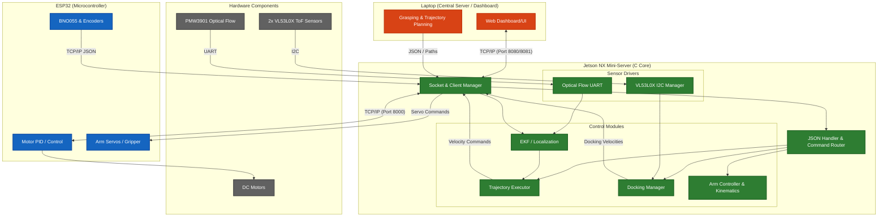
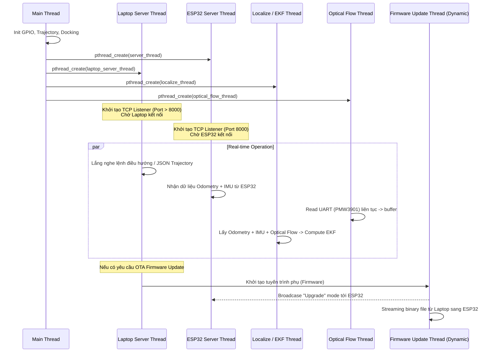
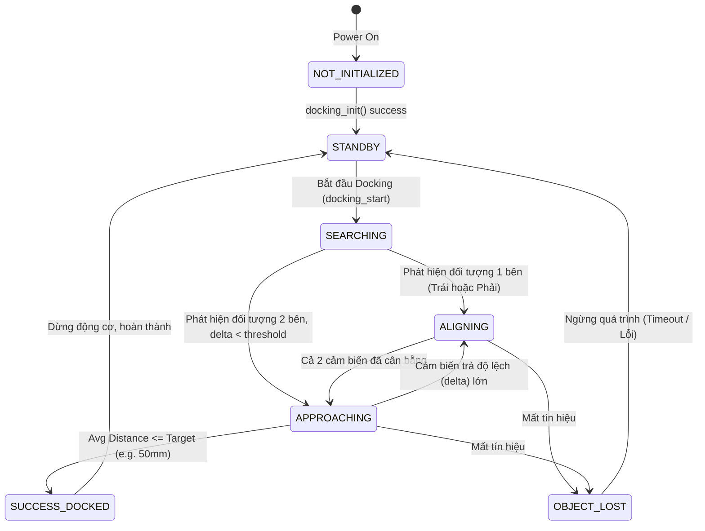
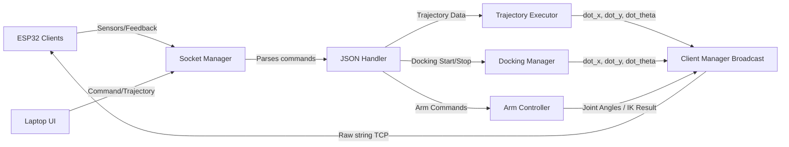

# Kiến Trúc Hệ Thống Jetson Mini-Server

Tài liệu này trình bày các biểu đồ kiến trúc hệ thống chi tiết cho `mini_server` chạy trên Jetson, bao gồm kiến trúc phần mềm, mô hình đa luồng (multi-threading), và kết nối phần cứng. Các thành phần được thiết kế theo hướng module hóa cao (modular design) để thuận tiện cho việc bảo trì và mở rộng.

## 1. Biểu Đồ Kiến Trúc Tổng Quan (System Architecture)

Hệ thống được chia làm 3 phân hệ chính: Laptop Dashboard (Máy chủ điều khiển trung tâm), Jetson Mini-Server (Máy chủ vi mạch/Edge Computing), và ESP32/Phần cứng dưới quyền (Cơ cấu chấp hành và cảm biến tầng thấp).

## 2. Mô Hình Đa Luồng Nội Bộ (Internal Threading Model)

`mini_server` khởi tạo và duy trì các luồng song song (pthread) để xử lý các tác vụ bất đồng bộ, đảm bảo tính thời gian thực (real-time) mà không khóa (block) lẫn nhau.

## 3. Quản Lý Trạng Thái Của Chức Năng Docking (State Machine)

Core logic của tính năng tiếp cận mục tiêu (Docking) sử dụng 2 cảm biến ToF VL53L0X để xác định khoảng cách và góc lệch.

## 4. Đặc tả Giao Tiếp Dữ Liệu Socket (Data Flow)

Luồng đi của dữ liệu từ và đến Jetson Mini-Server, đặc biệt là xử lý `JSON` payload:

## 5. Tổ Chức Thư Mục Mã Nguồn

Sơ đồ thể hiện cách phân tách mã nguồn trong Jetson Mini-Server:

*   **/src**
    *   `main.c`: Entry point, khởi tạo hệ thống và quản lý thread.
    *   `socket.c`: Quản lý TCP server cho Laptop và ESP32.
    *   `ekf.c` / `localize.c`: Thuật toán EKF và luồng tính toán vị trí.
    *   `docking.c`: Các API tiếp cận đích thông minh.
    *   `arm_controller.c` / `arm_kinematic.c`: Thuật toán cho cánh tay robot.
    *   `trajectory_executor.c`: Tính toán và di chuyển theo điểm tọa độ định trước.
*   **/vl53l0x**
    *   `vl53l0x_manager.c` & `vl53l0x_c.c`: Driver hạt nhân qua I2C.
    *   `gpio_helper.c`: Điều khiển chân XSHUT cứng của Jetson NX.
*   **/inc**: Các header file định nghĩa dữ liệu public.
