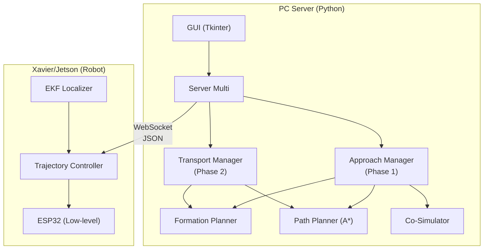
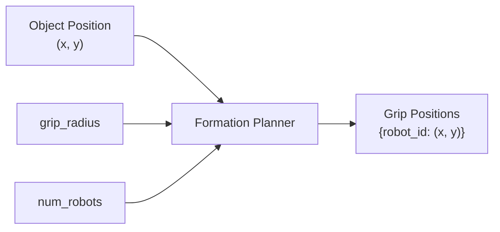
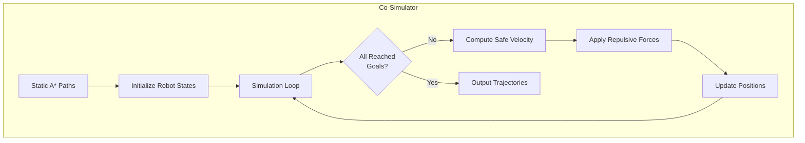
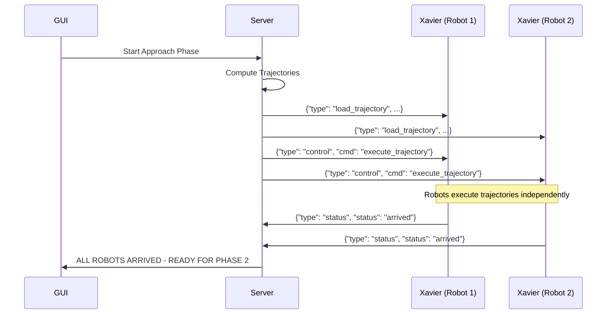
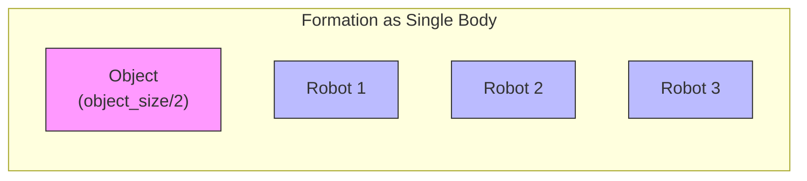
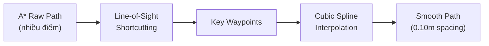
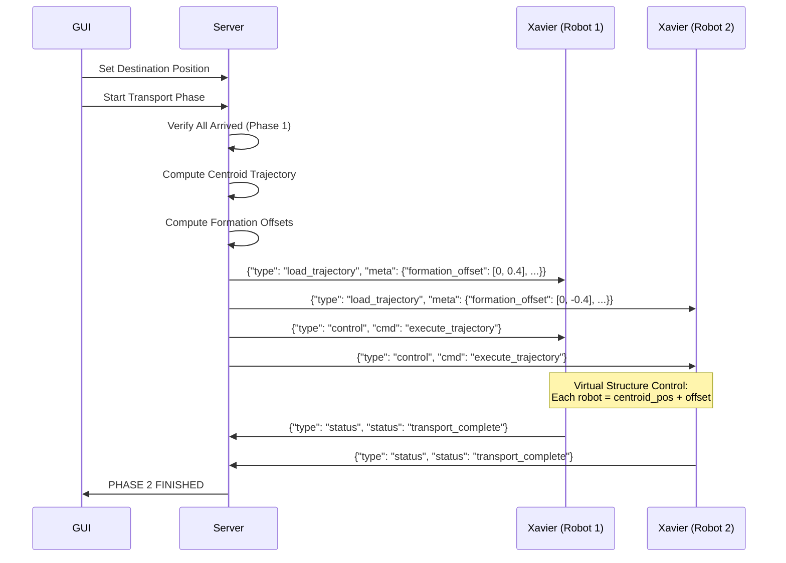

# 📋 Tài Liệu Mô Tả Hệ Thống - Multi-Robot Cooperative Transport

> **Phiên bản:** 1.0  
> **Ngày cập nhật:** 2026-01-15  
> **Tác giả:** System Documentation

---

## 📌 Tổng Quan Hệ Thống

Hệ thống Multi-Robot Cooperative Transport là một giải pháp điều khiển đa robot phối hợp để nâng và vận chuyển vật thể. Hệ thống sử dụng robot Mecanum 4 bánh với cánh tay gripper, hoạt động theo kiến trúc **Server-Client** qua giao thức **WebSocket/TCP**.

### Kiến Trúc Tổng Thể



---

## 🔄 Luồng Làm Việc Chính

### Hai Pha Hoạt Động

| Phase | Tên | Mục Đích |
|-------|-----|----------|
| **Phase 1** | Approach | Robot di chuyển từ vị trí hiện tại đến vị trí grip xung quanh vật thể |
| **Phase 2** | Transport | Tất cả robot phối hợp vận chuyển vật thể đến điểm đích |

---

# 🚀 PHASE 1: APPROACH (Tiếp Cận)

## 1.1 Mô Tả Chức Năng

Phase 1 điều khiển các robot di chuyển từ vị trí ban đầu đến các **grip positions** (vị trí kẹp) được tính toán xung quanh vật thể. Mỗi robot có một vị trí kẹp riêng, được phân bố đều theo hình tam giác (3 robot) hoặc đối diện (2 robot).

## 1.2 Inputs (Đầu Vào)

| Input | Kiểu Dữ Liệu | Mô Tả | Nguồn |
|-------|--------------|-------|-------|
| `robot_positions` | `Dict[int, Tuple[x, y, theta]]` | Vị trí hiện tại của từng robot | EKF từ Xavier hoặc Manual Input |
| `object_position` | `Tuple[x, y]` | Tọa độ trung tâm vật thể (m) | GUI Input / Detection |
| `object_size` | `float` | Đường kính vật thể (m) | GUI Input |
| `num_robots` | `int` | Số lượng robot (2 hoặc 3) | GUI Config |
| `grip_radius` | `float` | Khoảng cách grip = object_size/2 + arm_base + gripper_length | Auto-calculated |
| `approach_velocity` | `float` | Vận tốc di chuyển (m/s), mặc định 0.2 | GUI Config |
| `obstacles` | `List[Dict]` | Danh sách chướng ngại vật | Path Planner |

## 1.3 Quy Trình Xử Lý Chi Tiết

### Bước 1: Tính Toán Grip Positions



**Công thức tính grip position:**
```
grip_x = object_x + grip_radius × cos(angle_rad)
grip_y = object_y + grip_radius × sin(angle_rad)
```

**Formation Angles (góc mặc định):**

| Cấu Hình | Robot 1 | Robot 2 | Robot 3 |
|----------|---------|---------|---------|
| 3 Robots | 90° (Top) | 210° (Bottom-left) | 330° (Bottom-right) |
| 2 Robots | 90° (Top) | 270° (Bottom) | - |

### Bước 2: Tạo Static Paths với A*

```python
# Mỗi robot được tạo path riêng qua A* Path Planner
static_paths = {}
for robot_id, start_pos in robot_positions.items():
    goal_pos = grip_positions[robot_id]
    path = generate_safe_approach_path(
        planner=path_planner,
        start_pos=start_pos,
        goal_pos=goal_pos,
        object_pos=object_position,
        object_size=object_size,
        robot_radius=0.25
    )
    static_paths[robot_id] = path
```

**Two-Phase Approach Path:**
- **Transit Phase:** Di chuyển bên ngoài vùng `object_radius + robot_radius`
- **Final Approach:** Đường thẳng vào vị trí grip

### Bước 3: Co-Simulation (Đồng bộ hóa Multi-Robot)



**Các tham số Co-Simulation:**

| Tham Số | Giá Trị | Mô Tả |
|---------|---------|-------|
| `safety_radius` | 0.4m | Khoảng cách tối thiểu giữa 2 robot |
| `influence_radius` | 0.6m | Khoảng cách bắt đầu tạo lực đẩy |
| `time_step` | 0.1s | Bước thời gian simulation |
| `velocity` | 0.2 m/s | Vận tốc di chuyển |
| `goal_tolerance` | 1e-10 m | Ngưỡng xác định đã đến đích |
| `max_steps` | 2000 | Số bước simulation tối đa |

### Bước 4: Tính Target Headings

Robot phải quay mặt hướng về vật thể khi đến grip position:

```python
# Y-axis heading convention (Theta=0 → North)
angle = atan2(dy, dx) - π/2
```

## 1.4 Outputs (Đầu Ra)

### Trajectory Format

```json
{
  "type": "load_trajectory",
  "trajectory": [
    {"x": 1.234, "y": 2.345, "theta": 0.785, "t": 1737000001.0},
    {"x": 1.300, "y": 2.400, "theta": 0.785, "t": 1737000002.0},
    ...
  ],
  "meta": {
    "phase": "approach",
    "grip_pos": [1.5, 3.0],
    "object_pos": [1.0, 2.5]
  }
}
```

### Trajectory Data Fields

| Field | Kiểu | Đơn Vị | Mô Tả |
|-------|------|--------|-------|
| `x` | float | meters | Tọa độ X (Global Frame) |
| `y` | float | meters | Tọa độ Y (Global Frame) |
| `theta` | float | radians | Heading (Y-axis convention: 0 = North) |
| `t` | float | epoch seconds | Thời điểm phải đến vị trí này |

### Execution Command

Sau khi load trajectory thành công, Server gửi ngay lập tức lệnh thực thi:

```json
{
  "type": "control", 
  "cmd": "execute_trajectory"
}
```

### File Log Output

Trajectory được lưu vào `trajectory_logs/robot_{id}.txt`:
```
# Trajectory for Robot 1
# x, y, theta, t
1.2340, 2.3450, 0.7850, 1737000001.000
1.3000, 2.4000, 0.7850, 1737000002.000
...
```

## 1.5 WebSocket Communication Flow



## 1.6 Ràng Buộc và Giới Hạn

> [!WARNING]
> **Các ràng buộc quan trọng cần lưu ý**

| Ràng Buộc | Giá Trị | Hậu Quả Nếu Vi Phạm |
|-----------|---------|---------------------|
| Số robot | 2 hoặc 3 | `ValueError` exception |
| Path blocked | - | Báo lỗi "Target UNREACHABLE" |
| Robot collision | < 0.4m | Lực đẩy repulsive tự động |
| Object trong obstacle | - | Path planning fail |

> [!IMPORTANT]
> **Field-Oriented Control (FOC):**  
> Tất cả velocity vectors (`x`, `y`) đều ở **GLOBAL FRAME**. ESP32 firmware chịu trách nhiệm chuyển đổi sang Body Frame cho Mecanum.

---

# 🚚 PHASE 2: TRANSPORT (Vận Chuyển)

## 2.1 Mô Tả Chức Năng

Phase 2 sử dụng **Virtual Structure Control** - tất cả robot theo dõi cùng một trajectory **CENTROID** (tâm vật thể) và duy trì vị trí tương đối (formation offset) không đổi.

## 2.2 Inputs (Đầu Vào)

| Input | Kiểu Dữ Liệu | Mô Tả | Nguồn |
|-------|--------------|-------|-------|
| `object_position` | `Tuple[x, y]` | Vị trí hiện tại của vật thể (start) | From Phase 1 |
| `destination_position` | `Tuple[x, y]` | Tọa độ đích của vật thể | GUI Input |
| `transport_velocity` | `float` | Vận tốc vận chuyển (m/s) | GUI Config |
| `arrived_robots` | `List[int]` | Robot đã hoàn thành Phase 1 | Approach Manager |
| `obstacles` | `List[Dict]` | Chướng ngại vật (không bao gồm object đang vận chuyển) | Path Planner |

## 2.3 Quy Trình Xử Lý Chi Tiết

### Bước 1: Tính Effective Radius

Formation được xem như một **unified body** với bán kính:

```python
grip_radius = (object_size / 2) + arm_base_length + gripper_length
effective_radius = grip_radius + robot_radius
```



### Bước 2: Obstacle Inflation

Để đảm bảo toàn bộ formation có thể đi qua, obstacles được **inflate** (phóng to):

```python
inflated_radius = original_radius + effective_radius + spline_margin
# spline_margin = 0.15m (cho phép cubic spline cắt góc)
```

> [!NOTE]
> Object đang được vận chuyển bị **loại trừ** khỏi danh sách obstacle.

### Bước 3: A* Path Planning cho Centroid

```python
centroid_path = transport_planner.plan_path(
    start_pos=object_position,  # Current centroid
    end_pos=destination_position
)
```

### Bước 4: Path Smoothing (Cubic Spline)



**Tham số Cubic Spline:**

| Tham Số | Giá Trị | Mô Tả |
|---------|---------|-------|
| `smoothing_factor` | 0.1 | Độ mượt (cao hơn = mượt hơn, kém chính xác hơn) |
| `output_spacing` | 0.10m | Khoảng cách giữa các điểm output |
| `k` (degree) | 3 (cubic) | Bậc của spline |

### Bước 5: Timestamp Generation

```python
t = start_time + (cumulative_distance / transport_velocity)
```

### Bước 6: Compute Formation Offsets

```python
# Offset = vị trí robot so với centroid (trong hệ tọa độ centroid = origin)
offsets = {}
positions = compute_grip_positions((0.0, 0.0))  # Object at origin
centroid = average(positions)
for robot_id, pos in positions.items():
    offsets[robot_id] = (pos[0] - centroid[0], pos[1] - centroid[1])
```

**Ví dụ Formation Offsets (3 robots):**

| Robot | dx | dy | Góc |
|-------|----|----|-----|
| 1 | 0.0 | +0.40 | 90° (Top) |
| 2 | -0.35 | -0.20 | 210° (Bottom-left) |
| 3 | +0.35 | -0.20 | 330° (Bottom-right) |

## 2.4 Outputs (Đầu Ra)

### Trajectory Message Format

```json
{
  "type": "load_trajectory",
  "trajectory": [
    {"x": 5.000, "y": 4.180, "theta": 0.0, "t": 1737000001.0},
    {"x": 5.100, "y": 4.180, "theta": 0.0, "t": 1737000001.5},
    ...
  ],
  "meta": {
    "phase": "transport",
    "trajectory_type": "centroid",
    "formation_offset": [0.35, -0.20],
    "robot_id": 3,
    "destination": [8.0, 6.0],
    "num_robots": 3
  }
}
```

### Meta Fields Explained

| Field | Kiểu | Mô Tả |
|-------|------|-------|
| `phase` | string | `"transport"` - Phase identifier |
| `trajectory_type` | string | `"centroid"` - Loại trajectory |
| `formation_offset` | `[dx, dy]` | Offset của robot này so với centroid |
| `robot_id` | int | ID của robot nhận message |
| `destination` | `[x, y]` | Điểm đích cuối cùng |
| `num_robots` | int | Số robot tham gia transport |

### File Log Output

Trajectory được lưu vào `trajectory_logs/phase2.txt`:
```
# Phase 2 Transport Trajectory (Centroid)
# Format: x, y, theta, t
# Total points: 45
# =====================================
5.000000, 4.180000, 0.000000, 1737000001.000000
5.100000, 4.180000, 0.000000, 1737000001.500000
...
```

## 2.5 WebSocket Communication Flow



## 2.6 Virtual Structure Control (Xavier Side)

> [!IMPORTANT]
> **Xavier/Jetson thực hiện:**

```python
# Trajectory point tại thời điểm t
centroid_x, centroid_y = interpolate_trajectory(t)

# Vị trí target của robot này
robot_target_x = centroid_x + formation_offset[0]
robot_target_y = centroid_y + formation_offset[1]

# Control loop để đến vị trí target
velocity = pid_controller(current_pos, robot_target)
```

## 2.7 Ràng Buộc và Giới Hạn

| Ràng Buộc | Giá Trị | Hậu Quả Nếu Vi Phạm |
|-----------|---------|---------------------|
| Minimum robots | ≥ 2 | Báo lỗi "Need at least 2 robots" |
| Phase 1 complete | All arrived | Báo lỗi "Not all robots arrived" |
| Destination set | Required | Báo lỗi "Destination not set" |
| Path blocked | - | Báo lỗi "No transport path found" |
| Formation theta | 0.0 | Chỉ translation, không rotation |

---

# 📡 Giao Thức Truyền Thông

## Message Types: Server → Robot

| Type | Command | Mô Tả |
|------|---------|-------|
| `load_trajectory` | - | Gửi trajectory data |
| `control` | `execute_trajectory` | Bắt đầu thực thi trajectory |
| `control` | `stop` | Emergency stop |
| `kinematic` | `dot_x, dot_y, dot_theta` | Manual velocity control |
| `position_goal` | `x, y, theta` | Single point goal |

## Message Types: Robot → Server

| Type | Content | Mô Tả |
|------|---------|-------|
| `status` | `arrived` | Phase 1: Đã đến grip position |
| `status` | `transport_complete` | Phase 2: Đã hoàn thành transport |
| `position` | `{"source": "EKF", "x":..., "y":..., "heading":...}` | Vị trí hiện tại từ EKF |
| `log` | `message` | Log message for debug |

## JSON Message Examples

### Load Trajectory
```json
{
  "type": "load_trajectory",
  "trajectory": [
    {"x": 1.0, "y": 2.0, "theta": 0.5, "t": 1737000000.0}
  ],
  "meta": {
    "phase": "approach",
    "grip_pos": [1.5, 3.0]
  }
}
```

### Execute Command
```json
{"type": "control", "cmd": "execute_trajectory"}
```

### Status Update
```json
{"type": "status", "status": "arrived"}
```

---

# ⚙️ Cấu Hình Hệ Thống

## Các Tham Số Có Thể Điều Chỉnh

| Tham Số | Default | Phạm Vi | Mô Tả |
|---------|---------|---------|-------|
| `num_robots` | 3 | 2-3 | Số lượng robot |
| `object_size` | 0.2m | 0.1-1.0m | Đường kính vật thể |
| `gripper_length` | 0.15m | - | Chiều dài gripper |
| `arm_base_length` | 0.10m | - | Khoảng cách từ tâm robot đến base cánh tay |
| `robot_radius` | 0.25m | - | Bán kính robot |
| `approach_velocity` | 0.2 m/s | 0.05-0.5 | Vận tốc Phase 1 |
| `transport_velocity` | 0.1 m/s | 0.05-0.3 | Vận tốc Phase 2 |
| `safety_radius` | 0.4m | - | Khoảng cách an toàn giữa robots |
| `influence_radius` | 0.6m | - | Bán kính tác động repulsive force |

## File Structure

```
server/
├── main_multi.py              # Entry point
├── server_multi.py            # Main server logic
├── server_gui_multi.py        # GUI interface
├── approach_manager.py        # Phase 1 orchestration
├── transport_manager.py       # Phase 2 orchestration
├── formation_planner.py       # Grip position calculation
├── trajectory_manager.py      # Path generation utilities
├── synchronized_trajectory.py # Co-Simulation engine
├── path_planner.py           # A* path planning
├── vector_field.py           # Obstacle avoidance helpers
└── trajectory_logs/          # Trajectory log files
    ├── robot_1.txt
    ├── robot_2.txt
    └── phase2.txt
```

---

# 🔍 Debugging & Monitoring

## Trajectory Logs

| File | Phase | Content |
|------|-------|---------|
| `robot_1.txt` | Phase 1 | Trajectory cho Robot 1 |
| `robot_2.txt` | Phase 1 | Trajectory cho Robot 2 |
| `phase2.txt` | Phase 2 | Centroid trajectory |

## GUI Monitor Messages

```
Computing approach trajectories...
R1: Generated Safe Two-Phase Path (45 pts)
R2: Generated Safe Two-Phase Path (52 pts)
Generating synchronized collision-free trajectories (A* + CoSim)...
✓ All trajectories verified safe
Robot 1: Sent full trajectory (45 points)
Robot 2: Sent full trajectory (52 points)
Approach phase started for 2 robot(s)
Robot 1: Arrived at grip position
Robot 2: Arrived at grip position
=== ALL ROBOTS ARRIVED - READY FOR PHASE 2 (TRANSPORT) ===
```

---

# 📊 Tóm Tắt So Sánh Phase 1 vs Phase 2

| Đặc Điểm | Phase 1 (Approach) | Phase 2 (Transport) |
|----------|-------------------|---------------------|
| **Mục tiêu** | Các robot đến grip positions | Vận chuyển vật thể đến đích |
| **Control Mode** | Independent trajectories | Virtual Structure (chung centroid) |
| **Trajectory** | Riêng cho mỗi robot | Chung 1 centroid + offset |
| **Collision Avoidance** | Dynamic (Co-Simulation) | Static (Inflated obstacles) |
| **Heading Control** | Quay về phía object | Giữ nguyên (theta=0) |
| **Path Smoothing** | A* + Repulsive forces | Cubic Spline |
| **Velocity** | 0.2 m/s (default) | 0.1 m/s (default) |

---

> [!CAUTION]
> **CRITICAL: Field-Oriented Control**
> 
> Toàn bộ velocity commands (`dot_x`, `dot_y`) ở **GLOBAL FRAME**. 
> **KHÔNG** thực hiện rotation matrix ở high-level Python code.
> ESP32 firmware chịu trách nhiệm chuyển đổi Global → Body cho Mecanum kinematics.
