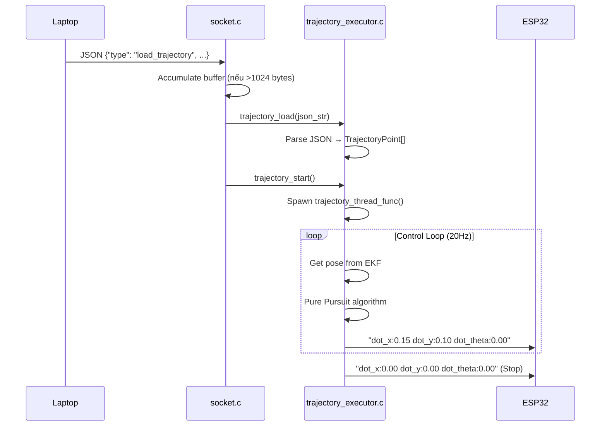

# Trajectory Execution Flow

Tài liệu mô tả chi tiết luồng xử lý khi Xavier NX nhận JSON `load_trajectory` từ Laptop.

---

## 1. Tổng quan luồng xử lý



---

## 2. Chi tiết từng bước

### Bước 1: Nhận JSON từ Laptop ([socket.c](file:///home/huynhan1607/Multiple_Mobile_Robot/mini_server/src/socket.c#L395-L449))

```c
// Kiểm tra xem có phải trajectory JSON không
bool is_traj_start = (strstr(buffer, "\"type\":\"load_trajectory\"") ||
                      strstr(buffer, "\"type\": \"load_trajectory\""));

if (is_traj_start || g_accumulating_traj) {
    // Tích lũy vào buffer 16KB cho đến khi JSON hoàn chỉnh
    // ...
    if (json_complete) {
        trajectory_load(g_traj_buffer);  // Parse JSON
        trajectory_start();               // Bắt đầu thực thi
    }
}
```

**Lưu ý**: Buffer 16KB giải quyết vấn đề TCP fragmentation cho trajectory JSON dài.

---

### Bước 2: Parse JSON ([trajectory_executor.c](file:///home/huynhan1607/Multiple_Mobile_Robot/mini_server/src/trajectory_executor.c#L55-L112))

**Input JSON format:**
```json
{
  "type": "load_trajectory",
  "trajectory": [
    {"x": 0.0, "y": 0.0, "t": 1768036376.918},
    {"x": 0.37, "y": 0.34, "t": 1768036379.468},
    {"x": 0.45, "y": 0.42, "theta": 1.57, "t": 1768036380.018}
  ],
  "meta": {"phase": "approach", "grip_pos": [5.0, 4.6]}
}
```

**Xử lý:**
```c
bool trajectory_load(const char* json_str) {
    cJSON* root = cJSON_Parse(json_str);
    cJSON* traj_array = cJSON_GetObjectItem(root, "trajectory");
    
    for (int i = 0; i < size; i++) {
        g_trajectory.points[i].x = x->valuedouble;
        g_trajectory.points[i].y = y->valuedouble;
        g_trajectory.points[i].t = t->valuedouble;        // Optional
        g_trajectory.points[i].theta = theta->valuedouble; // Optional
    }
    return true;
}
```

**Data structure:**
| Field | Type | Mô tả |
|-------|------|-------|
| `x` | float | Tọa độ X (Global Frame) |
| `y` | float | Tọa độ Y (Global Frame) |
| `t` | float | Timestamp (optional) |
| `theta` | float | Góc heading (optional) |

---

### Bước 3: Bắt đầu thực thi ([trajectory_executor.c](file:///home/huynhan1607/Multiple_Mobile_Robot/mini_server/src/trajectory_executor.c#L114-L134))

```c
void trajectory_start(void) {
    g_trajectory.active = true;
    g_trajectory.current_index = 0;
    g_trajectory.start_time_ms = get_time_ms();
    
    // Tạo thread điều khiển
    pthread_create(&g_traj_thread, NULL, trajectory_thread_func, NULL);
}
```

---

### Bước 4: Pure Pursuit Control Loop ([trajectory_executor.c](file:///home/huynhan1607/Multiple_Mobile_Robot/mini_server/src/trajectory_executor.c#L156-L279))

**Tham số điều khiển:**
| Parameter | Value | Mô tả |
|-----------|-------|-------|
| `lookahead_dist` | 0.40m | Khoảng cách lookahead |
| `acceptance_radius` | 0.10m | Bán kính chấp nhận đích |
| `kp` | 1.5 | Độ lợi P-controller |
| `max_vel` | 0.3 m/s | Vận tốc tối đa |
| Control rate | 20 Hz | Tần số vòng điều khiển (50ms/iteration) |

---

## Chi tiết thuật toán Pure Pursuit

### Tổng quan

Pure Pursuit là thuật toán path-following, robot luôn "nhắm" vào một điểm phía trước (lookahead point) thay vì điểm gần nhất. Điều này giúp:
- **Trajectory mượt hơn** - không bị giật khi qua từng waypoint
- **Skip waypoint dày đặc** - không cần đi chính xác qua mỗi điểm
- **Tự động điều chỉnh** - lookahead xa hơn sẽ cắt góc, gần hơn sẽ bám sát

```
    Trajectory Points:  •---•---•---•---•---●---•---•---•---◎
                        0   1   2   3   4   5   6   7   8  GOAL
                                        ↑
                                   Lookahead Point
                        
    Robot Position: ★ (đang ở giữa point 3 và 4)
    
    ★ ----------------→ ● (vector tới lookahead point)
         Velocity Command
```

---

### Step A: Lấy vị trí hiện tại từ EKF

```c
// Lines 178-183
pthread_mutex_lock(&g_ekf_mutex);
float cur_x = (float)g_ekf.x[0];     // Vị trí X từ EKF (meters)
float cur_y = (float)g_ekf.x[1];     // Vị trí Y từ EKF (meters)  
float cur_theta = (float)g_ekf.x[4]; // Heading (rad) - chỉ dùng debug
pthread_mutex_unlock(&g_ekf_mutex);
```

> [!NOTE]
> `cur_theta` **KHÔNG** được dùng để transform vận tốc! Theo FOC architecture, ESP32 sẽ xử lý việc này.

---

### Step B: Tìm Lookahead Point

```c
// Lines 188-206
int lookahead_idx = current_idx;

for (int i = current_idx; i < count; i++) {
    // Tính khoảng cách từ robot tới waypoint i
    float dx_search = g_trajectory.points[i].x - cur_x;
    float dy_search = g_trajectory.points[i].y - cur_y;
    float dist_to_point = sqrtf(dx_search * dx_search + dy_search * dy_search);

    if (dist_to_point > lookahead_dist) {
        // Tìm thấy điểm đầu tiên NGOÀI vòng tròn lookahead
        lookahead_idx = i;
        break;
    }
    // Nếu điểm này trong vòng tròn → cập nhật index, tiếp tục tìm
    lookahead_idx = i;
}

// Edge case: Nếu tất cả điểm còn lại đều trong vòng lookahead → nhắm vào điểm cuối
if (lookahead_idx >= count) {
    lookahead_idx = count - 1;
}
```

**Giải thích trực quan:**

```
Vòng tròn Lookahead (r = 0.4m)
        ╭─────────────────╮
       ╱                   ╲
      │    •   •   •        │   ← Các điểm trong vòng (SKIP)
      │       ★ Robot       │
      │                     │
       ╲                   ╱
        ╰─────────────────╯
                               ● Lookahead Point (điểm đầu tiên NGOÀI vòng)
```

---

### Step C: Cập nhật Current Index

```c
// Lines 210-214
pthread_mutex_lock(&g_traj_mutex);
if (lookahead_idx > g_trajectory.current_index) {
    g_trajectory.current_index = lookahead_idx;
}
pthread_mutex_unlock(&g_traj_mutex);
```

**Mục đích**: "Consume" các waypoint đã đi qua, iteration sau không cần quét lại từ đầu.

---

### Step D: Tính Error Vector (Global Frame)

```c
// Lines 216-222
TrajectoryPoint target = g_trajectory.points[lookahead_idx];

float dx = target.x - cur_x;  // Error theo X
float dy = target.y - cur_y;  // Error theo Y
float distance_to_target = sqrtf(dx * dx + dy * dy);
```

**Ví dụ:**
```
Robot tại:      (1.5, 2.0)
Lookahead tại:  (2.0, 2.3)
───────────────────────────
dx = 2.0 - 1.5 = 0.5
dy = 2.3 - 2.0 = 0.3
distance = sqrt(0.5² + 0.3²) = 0.583m
```

---

### Step E: Kiểm tra điều kiện dừng

```c
// Lines 224-236
TrajectoryPoint final_point = g_trajectory.points[count - 1];
float dx_final = final_point.x - cur_x;
float dy_final = final_point.y - cur_y;
float distance_to_final = sqrtf(dx_final * dx_final + dy_final * dy_final);

if (distance_to_final < acceptance_radius) {  // < 0.10m
    trajectory_stop();
    return;
}
```

> [!IMPORTANT]
> Robot CHỈ dừng khi đến gần **ĐIỂM CUỐI CÙNG**, không phải lookahead point!

---

### Step F: P-Controller tính vận tốc

```c
// Lines 238-250
float cmd_dot_x = kp * dx;   // kp = 1.5
float cmd_dot_y = kp * dy;

// Clamp vận tốc nếu quá lớn
float v_mag = sqrtf(cmd_dot_x * cmd_dot_x + cmd_dot_y * cmd_dot_y);
if (v_mag > max_vel) {       // max_vel = 0.3 m/s
    cmd_dot_x = (cmd_dot_x / v_mag) * max_vel;
    cmd_dot_y = (cmd_dot_y / v_mag) * max_vel;
}
```

**Ví dụ tính toán:**
```
dx = 0.5, dy = 0.3, kp = 1.5, max_vel = 0.3

Bước 1: Tính vận tốc raw
  cmd_dot_x = 1.5 * 0.5 = 0.75 m/s
  cmd_dot_y = 1.5 * 0.3 = 0.45 m/s
  v_mag = sqrt(0.75² + 0.45²) = 0.875 m/s

Bước 2: Clamp (vì 0.875 > 0.3)
  scale = 0.3 / 0.875 = 0.343
  cmd_dot_x = 0.75 * 0.343 = 0.257 m/s
  cmd_dot_y = 0.45 * 0.343 = 0.154 m/s
```

---

### Step G: Gửi lệnh vận tốc tới ESP32

```c
// Lines 259-263
char cmd[128];
snprintf(cmd, sizeof(cmd), "dot_x:%.4f dot_y:%.4f dot_theta:%.4f\n", 
         cmd_dot_x, cmd_dot_y, 0.0f);
client_manager_broadcast(cmd, strlen(cmd));
```

**Output gửi đi:**
```
dot_x:0.2571 dot_y:0.1543 dot_theta:0.0000
```

> [!CAUTION]
> **CRITICAL**: Vận tốc này ở **GLOBAL FRAME**! ESP32 firmware sẽ nhân với rotation matrix để chuyển sang Body Frame cho Mecanum wheels.

---

### Step H: Loop tiếp tục

```c
// Line 276
usleep(CONTROL_LOOP_DELAY_US);  // Sleep 50ms (20Hz)
```

Sau đó quay lại Step A, lặp lại cho đến khi robot đến đích.

---

## Biểu đồ tổng hợp

```mermaid
flowchart TD
    A[Start Loop] --> B[Lấy pose từ EKF]
    B --> C[Quét trajectory tìm Lookahead Point]
    C --> D{Còn trong vòng lookahead?}
    D -->|Yes| C
    D -->|No| E[Cập nhật current_index]
    E --> F[Tính error vector dx, dy]
    F --> G{distance_to_final < 0.1m?}
    G -->|Yes| H[trajectory_stop → Send velocity 0]
    G -->|No| I[P-Controller: v = kp × error]
    I --> J{|v| > max_vel?}
    J -->|Yes| K[Clamp to max_vel]
    J -->|No| L[Giữ nguyên v]
    K --> M[Broadcast to ESP32]
    L --> M
    M --> N[Sleep 50ms]
    N --> A
```

---


