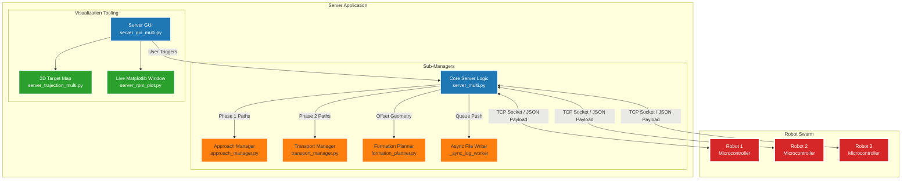
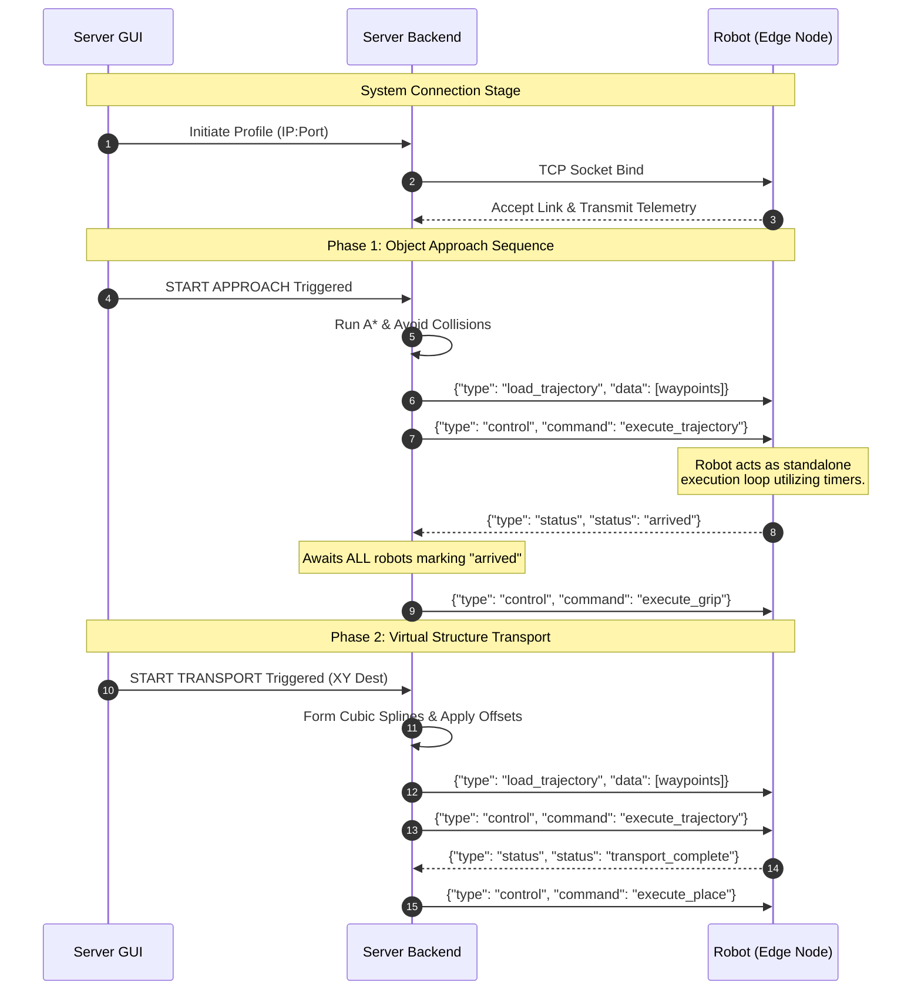
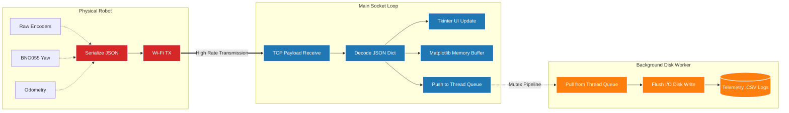

# Multi-Robot Server System Diagrams

To provide a visual and clearer view of how the system operates conceptually, here are three architectural plots drawn using Mermaid.js syntax. These diagram the application hierarchy, network logic flow, and high-frequency sensor telemetry.

## 1. High-Level Modular Architecture
This diagram outlines how the main Server loop distributes processing tasks across different Python modules, and how the physical robots interface.

## 2. Mission Logic Flow (Sequence Diagram)
This timeline dictates the sequential message logic exchanged during Phase 1 (Approach) and Phase 2 (Transport) between the orchestrator and the individual decentralized robot controllers.

## 3. Telemetry Pipeline & Disk Logging
Due to the high influx of network data (thousands of floats continuously transmitted per second), the Server prevents UI blocking by spreading mathematical parsing vs hard-drive storage writing across distinct threads and thread-lock queues in Python.

